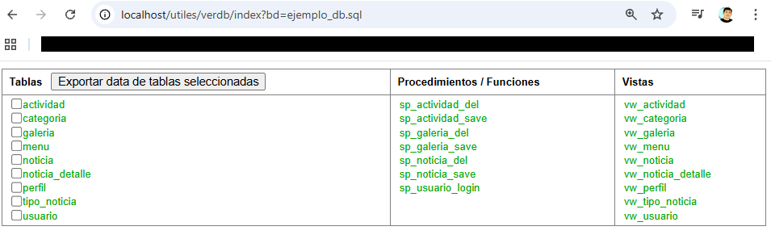
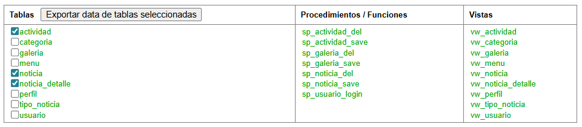
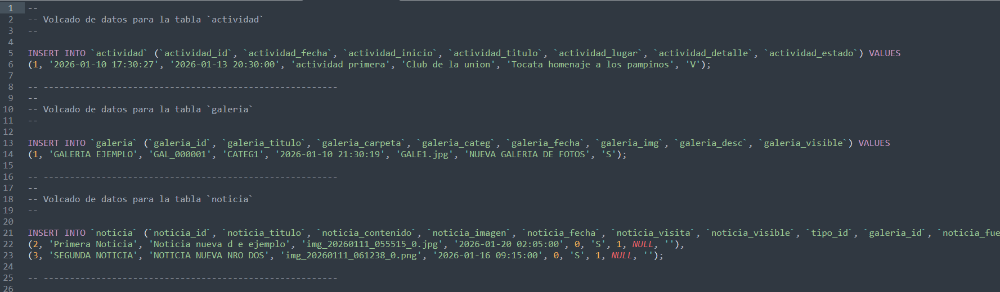

# phpmydump-explorer
Explore and extract data from phpMyAdmin SQL dumps using streaming parsing and insert indexing without loading the entire file into memory.

## Screenshots

### Table explorer

### Table selection

### Export result

